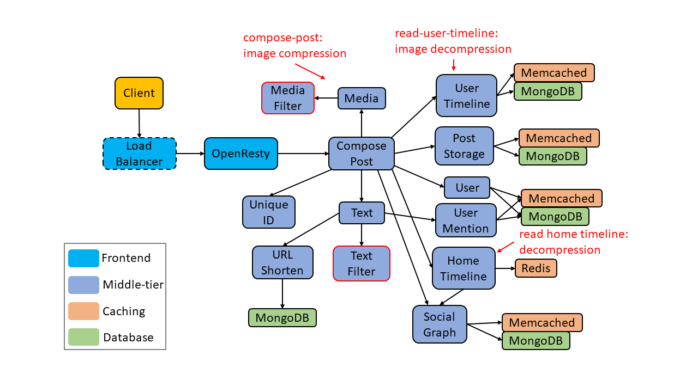

## Modification

`socialNetworkML` adds additional ML microservices (`TextFilterService`, `MediaFilterService`). Image data (using base64 encoding) has been directly inserted to the posts.
* `TextFilterService`: Check the probability for profanity or offensive language in strings using a pre-trained linear SVM model. Use pretrained tensorflow DistilBERT model to perform sentiment analysis. Model: https://huggingface.co/distilbert-base-uncased-finetuned-sst-2-english.
* `MediaFilterService`: Use pretrained tensorflow mobilenet model to filter out the NSFW images. Model: https://github.com/GantMan/nsfw_model.
*  `Media Service`: Compress the images (gzip) before saving them to the DB.
*  `Home Timeline Service`, `User Timeline Service`: After fetching the posts from the post service, decompress the images (gzip) in the posts.



## Deployment

### Build docker images

Build & push docker images. Choose your own `DOCKER_REGISTRY` (make sure that the k8s cluster has access to it).
```bash
# set arg DOCKER_REGISTRY
cd socialNetworkML
DOCKER_REGISTRY=harbor.harbor.svc.service.wpax.intel.com/dev/zzhou ./buid_images.sh
DOCKER_REGISTRY=harbor.harbor.svc.service.wpax.intel.com/dev/zzhou ./push_images.sh
```

### ML images
Taking `TextFilterService` as an example, it has three docker images.

`social-network-text-filter-service:latest` uses the official `tensowflow` package with `avx` support. (starting with TensorFlow 1.6, binaries use AVX instructions which may not run on older CPUs.)

`social-network-text-filter-service-opt-avx2:latest` uses the `tensowflow` package built from source with `avx2` support (using `tensorflow/tensorflow:devel` as the base image).

`social-network-text-filter-service-opt-avx512:latest` uses the `tensowflow` package built from source with `avx512` support.

Please check dockerfile `Dockerfile.opt.avx2` and `Dockerfile.opt.avx512` in `src/TextFilterService`:

```
RUN bazel build --config=opt --copt=-mavx --copt=-mavx2 --copt=-mfma \
    --copt=-mavx512f --copt=-mavx512cd \
    --local_cpu_resources=HOST_CPUS*.5 //tensorflow/tools/pip_package:build_pip_package && \
```

You might need to change the `--local_cpu_resources` settings to make sure that the building process would not suffer from OOM errors (using too many CPUs -> increase memory usage -> OOM).


### Problem with Intel Optimized Tensorflow
https://github.com/tensorflow/serving/issues/1272

### Create k8s manifest files


#### DSB Services
Convert the `docker-compose-k8s.yml`,  `docker-compose-k8s-opt-avx2.yml`,  `docker-compose-k8s-opt-avx512.yml` docker-compose files into k8s manifest files using `kompose`.
```bash
cd ${social-network-dir}/k8s-yaml
DOCKER_REGISTRY=harbor.harbor.svc.service.wpax.intel.com/dev/zzhou ./convert.sh

cd ${social-network-dir}/k8s-yaml-opt-avx2
DOCKER_REGISTRY=harbor.harbor.svc.service.wpax.intel.com/dev/zzhou ./convert.sh

cd ${social-network-dir}/k8s-yaml-opt-avx512
DOCKER_REGISTRY=harbor.harbor.svc.service.wpax.intel.com/dev/zzhou ./convert.sh
```

Deploy the services `deploy.sh`:
```bash
#!/bin/bash
NAMESPACE="deathstarbench-social-network"
# Create namespace
kubectl create namespace ${NAMESPACE}
# Deploy social network app under namespace
kubectl apply -f ./ -n ${NAMESPACE}
```

Clean up the services `cleanup.sh`:
```bash
#!/bin/bash
NAMESPACE="deathstarbench-social-network"
# Delete everything from the namespace
kubectl delete namespace $NAMESPACE
```

Services deployment and cleanup could be automated with `playground.py` script.

#### SocialNetworkClient 

Sadly, k8s yaml files do not support setting image names using env variables. You need to set them manually. Or you could use python client to automate the process (read the yaml file, modify it, and use `create_namespaced_deployment` to deploy it, check `playground/utils/k8s.py`).

Modify `image` in `locust/manifests/master-deployment.yaml` and `locust/manifests/worker-deployment.yaml`:

```yaml
containers:
- name: social-network-ml-client
  image: harbor.harbor.svc.service.wpax.intel.com/dev/zzhou/social-network-ml-client:latest # modify DOCKER_REGISTRY
```

#### Locust

Modify `image` in `locust/manifests/master-deployment.yaml` and `locust/manifests/worker-deployment.yaml`:

```yaml
containers:
- name: locust-master
  securityContext: {}
  image: "harbor.harbor.svc.service.wpax.intel.com/dev/zzhou/locust-ml:latest" # modify DOCKER_REGISTRY
```

### Init Social Graph

If you are using `playground.py` to run the experiment, please ignore this section. `playground.py` could create the `social-network-client` and init the social graph.

To do it manually:

Create `social-network-client` pod.
```bash
cd socialNetworkML/client
kubectl create -f social-network-client.yaml
```

Run cmds inside `social-network-client` pod.
```bash
kubectl exec -it social-network-client -- /bin/bash 
```

Initialize the social graph.
```bash
python3 /workspace/social-network/scripts/init_social_graph.py \
    --graph /workspace/social-network/datasets/social-graph/socfb-Reed98/socfb-Reed98.mtx \
    --ip http://nginx-thrift.deathstarbench-social-network.svc.cluster.local \
    --port 8080 \
    --compose 10
```

## Locust

To create Locust master & worker containers and run experimental commands inside the containers, please check the `playground.py` python script, which utilizes the python client for the kubernetes API to automate the process.

Or you could run the Locust experiment manually. Modify the mounted volumes in `locust/manifests` to your directories, change the number of replicas of locust workers in worker-deployment.yaml.

Modify `locust/docker-entrypoint.sh`, uncomment `nohup /usr/local/bin/locust $@ &`:
```bash
#!/bin/bash
set -eu
nohup /usr/local/bin/locust $@ &
# respond to docker stop (handle SIGINT) properly
trap : TERM INT
sleep infinity & wait
```

Modify `locust/manifests/master-deployment.yaml`:
```yaml
image: "harbor.harbor.svc.service.wpax.intel.com/dev/zzhou/locust-ml:latest" # modify DOCKER_REGISTRY
command: ["/bin/bash", "/docker-entrypoint.sh"]
args: ["--config=/mnt/locust/configs/master.conf"] # add your own args
```

You need to rebuild the docker image to make it work. Or you could mount your local files to the container to avoid rebuilding docker image every time. Check `locust/manifests-dev`, or `utils/k8s.py` (in `playground` repo).

For `args`, check https://docs.locust.io/en/stable/configuration.html.

Modify `locust/manifests/worker-deployment.yaml`:

```yaml
spec:
  selector:
    matchLabels:
      name: locust
      role: worker
  replicas: 20 # make it match the --expect-workers arg for master
```

The number of worker containers need to match the `expect-workers` of master.

Deploy the containers and run the experiment:
```bash
cd socialNetwork/locust/manifests
kubectl apply -f ./
```

The results & logs will be available in logs folder. You could copy them from the master container to your host machine:

```bash
kubectl cp locust-master-ddc9f58f5-ghwql:/mnt/locust/logs /mnt/san03RAID1/users/zzhou/Logs/logs-cp
```
